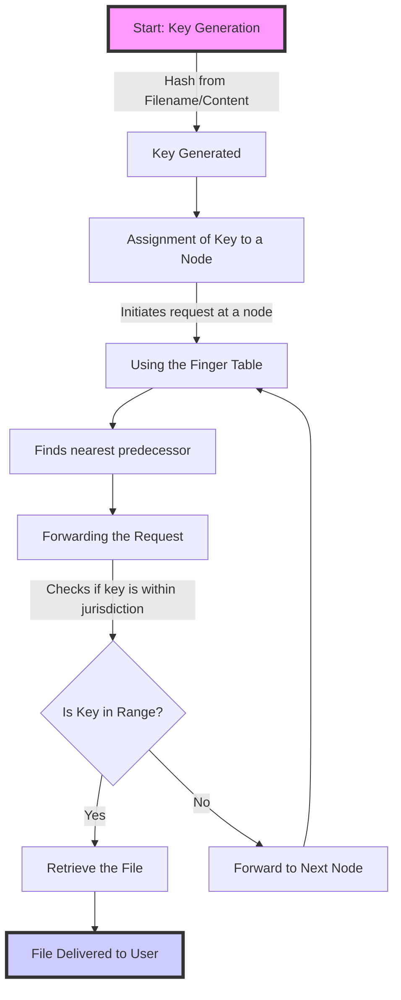
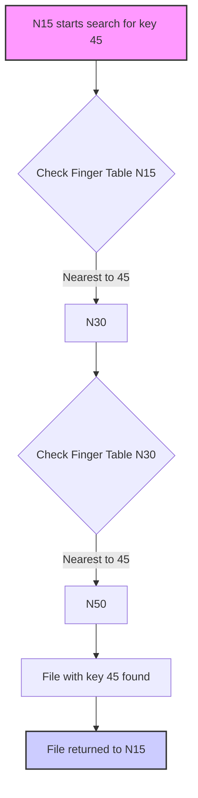

## Description

Chord is a simple search protocol for distributed peer-to-peer systems that uses keys on nodes.
It adapts efficiently to structural changes, such as the loss or addition of nodes, and ensures functionality even during this adaption.

The protocol scales logarithmically to the number of nodes in the system, both in terms of memory requirements and communication effort.

## Application example - Decentralised file sharing network (e.g. BitTorrent)

### 1. Key creation for each file

Each file in the network is identified by a unique key. Typically, the hash value of the filename/content or both.
The resulting hash-value is the representation of the file in the chord-network.

### 2. Key-assigning on the node

The key is assigned to a specific node in the network. Each node in a chord-system is responsible for holding the keys in a defined range that extends from its predecessor to its own node ID. 

To find out which node is responsible for a particular key, start a query at any node and follow the finger tables of the nodes until the responsible node is found.

### 3. Start request

Imagine a user would like to find a specific file. The user generates the hash-value of the file (the key) to identify the responsible node.

### 4. Use fingertables to localize the key

The requesting node uses its finger table to minimize the search effort. The finger table of each node contains information about other nodes in the network, with each entry pointing to a node that is exponentially further away.

The requesting node looks in the finger table for the closest predecessor of the key and forwards the request accordingly.

### 5. Forward request

The request is forwarded from node to node based on proximity to the target key until the node that is directly responsible for the key is reached.

Upon receiving the request, each node checks whether the requested key is within its area of responsibility. If not, it uses its finger table to forward the request to the nearest known node.

### 6. File request

As soon as the correct node that manages the key is found, the requesting user can retrieve the file directly from this node.

### Example

Let's assume we have a node N15 that is looking for a file whose key is 45. N15 checks its finger table and forwards the query to N30 because N30 is the closest node in the table to the key 45. N30 recognizes that the key 45 falls within the range for which N50 is responsible and finally forwards the request to N50, which saves the file and can send it to N15.

| Entry | Starts At   | Node |
|-------|-------------|------|
| 1     | N15 + 2^0   | N30  |
| 2     | N15 + 2^1   | N30  |
| 3     | N15 + 2^2   | N50  |
| 4     | N15 + 2^3   | N50  |

