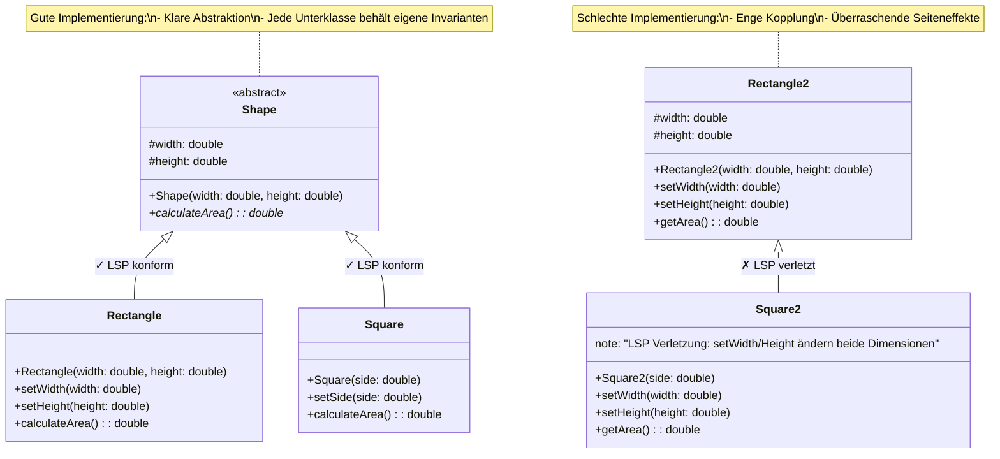

# Architektur Prinzipien

## SOLID

1. Single Responsibility
2. Open/Closed
3. Liskov Substitution
4. Interface Segregation
5. Dependency Inversion


### Single Responsibility (SRP)

**Prinzip**

Eine Klasse sollte nur eine Verantwortung haben, d.h. nur eine Ursache für Änderungen in der Spezifikation.

**Code**

```Java
// Problem: Eine Buch-Klasse übernimmt die Funktion des Druckens.
public class Book {
    private String name;
    private String author;
    private String text;

    public Book(String name, String author, String text) {
        this.name = name;
        this.author = author;
        this.text = text;
    }

    public void printTextToConsole() {
        System.out.println(text);
    }
}

// Lösung: Verschieben der Druckfunktion in eine separate Klasse.
public class BookPrinter {
    private Book book;

    public BookPrinter(Book book) {
        this.book = book;
    }

    public void printTextToConsole() {
        System.out.println(book.getText());
    }
}
```

Siehe [Single Responsibility](https://wiki.strubli.com/docs/swa/architecture-patterns/#single-responsibility-prinzip-srp)

### Open/Closed (OCP)

**Prinzip**

Software-Entitäten sollten für Erweiterungen offen, aber für Modifikationen geschlossen sein.

**Code**

```Java
// Problem: Unterschiedliches Verhalten für Kunden in einer Person-Klasse.
public class Person {
    private String firstName, lastName;

    public Person(String f, String l) {
        this.firstName = f;
        this.lastName = l;
    }

    public String toString() {
        return firstName + " " + lastName;
    }
}

// Lösung: Einführung von Subtypen.
public class Customer extends Person {
    private int turnover;

    public Customer(String f, String l, int turnover) {
        super(f, l);
        this.turnover = turnover;
    }

    public String toString() {
        return super.toString() + " " + turnover;
    }
}
```

### Liskov Substitution (LSP)

**Prinzip**

Subtypen müssen sich wie ihre Basistypen verhalten, ohne deren Verhalten zu brechen.

> "Objekte einer Superklasse sollen durch Objekte ihrer Subklassen ersetzt werden können, ohne dass die korrekte Funktionsweise des Programms beeinträchtigt wird."

**Hauptaspekte des LSP:**

- Verhaltenskompatibilität
  - Subklassen müssen alle Verträge (Contracts) der Basisklasse erfüllen
  - Keine Abschwächung der Vorbedingungen
  - Keine Verstärkung der Nachbedingungen
  - Invarianten müssen erhalten bleiben
- Signaturkompatibilität
  - Parameter-Typen dürfen in Subklassen nur weiter werden
  - Rückgabe-Typen dürfen in Subklassen nur enger werden
  - Exceptions dürfen nur weniger oder spezieller werden



**Gute Implementierung:**
- Shape als abstrakte Basisklasse
- Rectangle und Square als unabhängige Ableitungen
- Jede Klasse hat ihre eigenen, passenden Methoden
- LSP wird eingehalten, da jede Unterklasse die Basisklassen-Garantien erfüllt

**Schlechte Implementierung**
- Direkte Vererbung Rectangle2 -> Square2
- Square2 muss Methoden überschreiben, um Quadrat-Eigenschaften zu erzwingen
- LSP-Verletzung durch unerwartetes Verhalten der überschriebenen Methoden

**Best Practices**

1. Abstraktionen richtig verwenden
2. Ersetzbarkeit prüfen
3. Tell, Don't ask

**Code**

```Java
// Problem: Ein Bicycle erbt von TransportationVehicle, kann jedoch die Methode startEngine() nicht sinnvoll implementieren.
public class Bicycle extends TransportationVehicle {
    public void startEngine() {
        // Problematisch: Ein Fahrrad hat keinen Motor.
    }
}

// Lösung: Differenzierung der Hierarchie.
public abstract class TransportationVehicle {
    public abstract void move();
}

public class Bicycle extends TransportationVehicle {
    public void move() {
        System.out.println("Bicycle is moving.");
    }
}

public class Car extends TransportationVehicle {
    public void move() {
        System.out.println("Car is moving with engine.");
    }
}
```

### Interface Segregation (ISP)

**Prinzip**

Schnittstellen sollten spezifisch sein und nur Methoden enthalten, die relevant für die Implementierung sind.

**Code**

```Java
// Problem: Eine allgemeine Toy-Schnittstelle zwingt alle Klassen, unpassende Methoden zu implementieren.
public interface Toy {
    void setPrice(double price);
    void setColor(String color);
    void move();
    void fly();
}

// Lösung: Aufteilen in kleinere Schnittstellen.
public interface Toy {
    void setPrice(double price);
    void setColor(String color);
}

public interface Movable {
    void move();
}

public interface Flyable {
    void fly();
}
```

### Dependency Inversion (DIP)

**Prinzip**

Hochrangige Module sollten nicht von niedrigstufigen Modulen abhängen. Beide sollten von Abstraktionen abhängen.

**Code**

```Java
// Problem: Direkte Abhängigkeiten in der Project-Klasse.
public class Project {
    private BackEndDeveloper bd = new BackEndDeveloper();
    private FrontEndDeveloper fd = new FrontEndDeveloper();

    public void realizeMission() {
        bd.writeJava();
        fd.writeJavaScript();
    }
}

// Lösung: Einführung von Abstraktionen.
public interface Developer {
    void develop();
}

public class BackEndDeveloper implements Developer {
    public void develop() {
        System.out.println("I am a backend developer and write Java.");
    }
}

public class FrontEndDeveloper implements Developer {
    public void develop() {
        System.out.println("I am a frontend developer and write JavaScript.");
    }
}

public class Project {
    private List<Developer> developers;

    public Project(List<Developer> developers) {
        this.developers = developers;
    }

    public void realizeMission() {
        developers.forEach(Developer::develop);
    }
}
```