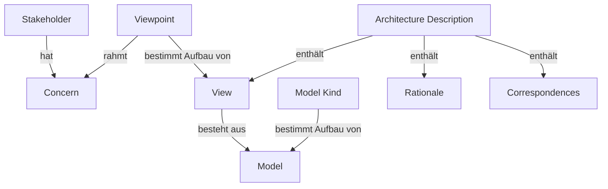

# Normen für Qualität und Architekturbeschreibung

Standards geben der Architekturarbeit zwei Dinge, die man sonst mühsam selbst
erfinden muss: eine **gemeinsame Sprache** und eine **Checkliste dessen, was man
vergessen könnte**. Für die Softwarearchitektur sind vor allem zwei Normen
relevant – die eine sagt, *was gute Software ausmacht*, die andere, *wie man
eine Architektur beschreibt*.

| Norm | Frage, die sie beantwortet |
| --- | --- |
| ISO/IEC 25000 (SQuaRE) | Woran messe ich die Qualität eines Systems? |
| ISO/IEC/IEEE 42010 | Was gehört in eine Architekturbeschreibung? |

---

## ISO/IEC 25000 – SQuaRE

**SQuaRE** steht für *Systems and software Quality Requirements and Evaluation*.
Die Normenfamilie hat die älteren Standards ISO/IEC 9126 (Qualitätsmodell) und
ISO/IEC 14598 (Bewertung) abgelöst und in einem gemeinsamen Rahmen
zusammengeführt.

### Aufbau der Normenfamilie

| Nummernkreis | Division | Inhalt |
| --- | --- | --- |
| 2500n | Quality Management | Leitfaden zu SQuaRE (25000), Planung und Management (25001) |
| 2501n | Quality Model | Produktqualität (25010), Datenqualität (25012) |
| 2502n | Quality Measurement | Messrahmen und konkrete Metriken (25020–25024) |
| 2503n | Quality Requirements | Qualitätsanforderungen formulieren (25030) |
| 2504n | Quality Evaluation | Bewertungsprozess (25040), Rollen (25041) |
| 25050–25099 | Extension | Ergänzungen, z. B. Anforderungen an Fertigsoftware (25051) |

Im Alltag begegnet einem fast immer nur **ISO/IEC 25010** – das ist das
Qualitätsmodell, auf das sich alle anderen Teile beziehen.

### ISO/IEC 25010 – das Qualitätsmodell

Das Modell zerlegt Produktqualität in acht Merkmale mit jeweils mehreren
Teilmerkmalen. Genau hier findet man die **nicht-funktionalen Anforderungen**
wieder, die sonst gerne unter „muss halt schnell und sicher sein" verschwinden.

| Merkmal | Teilmerkmale (Auswahl) |
| --- | --- |
| **Functional Suitability** | Vollständigkeit, Korrektheit, Angemessenheit |
| **Performance Efficiency** | Zeitverhalten, Ressourcenverbrauch, Kapazität |
| **Compatibility** | Koexistenz, Interoperabilität |
| **Usability** | Erlernbarkeit, Bedienbarkeit, Fehlertoleranz der Bedienung, Barrierefreiheit |
| **Reliability** | Reife, Verfügbarkeit, Fehlertoleranz, Wiederherstellbarkeit |
| **Security** | Vertraulichkeit, Integrität, Nichtabstreitbarkeit, Zurechenbarkeit, Authentizität |
| **Maintainability** | Modularität, Wiederverwendbarkeit, Analysierbarkeit, Änderbarkeit, Testbarkeit |
| **Portability** | Anpassbarkeit, Installierbarkeit, Austauschbarkeit |

Ergänzend beschreibt das Modell **Quality in Use** – Qualität aus Sicht der
Nutzenden statt aus Sicht des Produkts: Effektivität, Effizienz, Zufriedenheit,
Risikofreiheit und Kontextabdeckung. Ein System kann technisch einwandfrei sein
und trotzdem hier durchfallen.



### Wofür man das konkret benutzt

Der Nutzen liegt weniger im Zertifikat als in der Checkliste. Drei typische
Einsätze:

1. **Anforderungen vollständig bekommen.** Die Merkmalsliste als Fragenkatalog
   durchgehen: Zu jedem Punkt entweder eine Anforderung formulieren oder
   bewusst festhalten, dass er nicht relevant ist.
2. **Trade-offs benennen.** Sicherheit gegen Performance, Änderbarkeit gegen
   Effizienz – mit gemeinsamen Begriffen lässt sich eine Abwägung dokumentieren,
   statt sie implizit zu treffen.
3. **Messbar machen.** Ein Merkmal wird erst brauchbar, wenn eine Zahl
   dranhängt. Genau dafür gibt es die 2502n-Reihe.

---

## ISO/IEC/IEEE 42010 – Architekturbeschreibung

42010 ist der Nachfolger von IEEE 1471 und wird gemeinsam von ISO, IEC und IEEE
herausgegeben – daher der etwas sperrige Dreifachname. Der Standard beschreibt
**nicht**, wie man Architektur *macht*, sondern wie man sie **dokumentiert**.

### Die Kernidee

Ein System hat genau eine Architektur, aber beliebig viele mögliche
Beschreibungen davon. Welche Beschreibung sinnvoll ist, hängt davon ab, **wer
sie liest und was diese Person wissen will**. Aus dieser Beobachtung folgt die
ganze Begriffskette des Standards.

### Begriffe

| Begriff | Bedeutung |
| --- | --- |
| **Stakeholder** | Wer ein Interesse am System hat – Betrieb, Fachbereich, Security, Entwicklung |
| **Concern** | Ein konkretes Anliegen dieser Person, z. B. „Wie skaliert das?" |
| **Viewpoint** | Die Konvention, wie ein Anliegen dargestellt wird – Notation, Regeln, Zweck |
| **View** | Die tatsächliche Darstellung des Systems nach genau einem Viewpoint |
| **Model Kind** | Der Typ eines Modells innerhalb einer View, z. B. Sequenzdiagramm |
| **Correspondence** | Eine Beziehung zwischen Elementen verschiedener Views |
| **Rationale** | Die Begründung, warum so entschieden wurde – und was verworfen wurde |

Der Unterschied zwischen **Viewpoint** und **View** ist die Stelle, an der es
meist klemmt: Der Viewpoint ist die *Bauanleitung*, die View das *fertige
Bauwerk*. Ein Viewpoint kann auf viele Systeme angewendet werden, eine View
gehört immer zu genau einem.

### Was 42010 ausdrücklich nicht vorgibt

- **Keine Notation.** UML, ArchiMate, Boxen auf einem Whiteboard – alles erlaubt,
  solange der Viewpoint sie festlegt.
- **Kein Vorgehensmodell.** Wann welcher Schritt kommt, regeln Methoden wie
  die TOGAF ADM, nicht 42010.
- **Keine feste Menge an Sichten.** Das 4+1-Modell ist *ein* möglicher Satz von
  Viewpoints, nicht der vom Standard vorgeschriebene.

### Verhältnis zu den bekannten Frameworks

| Ansatz | Rolle gegenüber 42010 |
| --- | --- |
| **4+1 Sichtenmodell** | Ein konkreter Satz von Viewpoints – erfüllt 42010, ist aber nicht identisch damit |
| **TOGAF** | Liefert das Vorgehen (ADM); die Ergebnisdokumente lassen sich nach 42010 strukturieren |
| **ArchiMate** | Liefert Notation und Model Kinds |
| **Zachman** | Ordnet Beschreibungen nach Perspektive und Fragestellung, ähnlicher Grundgedanke |

Kurz: 42010 ist der **Rahmen**, die Frameworks füllen ihn.

---

## Weitere Standards im Umfeld

| Standard | Thema |
| --- | --- |
| ISO/IEC/IEEE 12207 | Prozesse im Software-Lebenszyklus |
| ISO/IEC/IEEE 15288 | Prozesse im System-Lebenszyklus |
| ISO/IEC/IEEE 29148 | Requirements Engineering – Anforderungen sauber formulieren |
| ISO/IEC 27001 | Informationssicherheits-Managementsystem (ISMS) |
| ISO/IEC 27017 / 27018 | Sicherheit und Datenschutz speziell für Cloud-Dienste |
| ISO/IEC 20000 | IT-Service-Management |
| ISO 9001 | Qualitätsmanagement auf Organisationsebene |

---

## Zusammenspiel

Die Normen greifen ineinander, ohne sich zu überschneiden:

- **29148** hilft, Anforderungen überhaupt erst zu formulieren.
- **25010** liefert dafür die Qualitätsmerkmale als Raster.
- **42010** legt fest, wie die daraus entstehende Architektur beschrieben wird.
- **12207 / 15288** ordnen das Ganze in den Lebenszyklus ein.
- **27001** kommt dazu, sobald Sicherheit nachweisbar sein muss.

---

## Siehe auch

- → [Architektur-Modelle](/docs/architecture/architecture-models) – 4+1, TOGAF, ArchiMate, Zachman und SOLID im Überblick
- → [Architektur-Methodik](/docs/architecture/swa/architecture-methodology) – funktionale und nicht-funktionale Anforderungen sauber trennen
- → [4+1 Sichtenmodell](/docs/architecture/swa/view-model) – ein System aus fünf Perspektiven beschreiben
- → [Architektur-Prinzipien](/docs/architecture/architecture-principles) – die SOLID-Prinzipien im Detail
