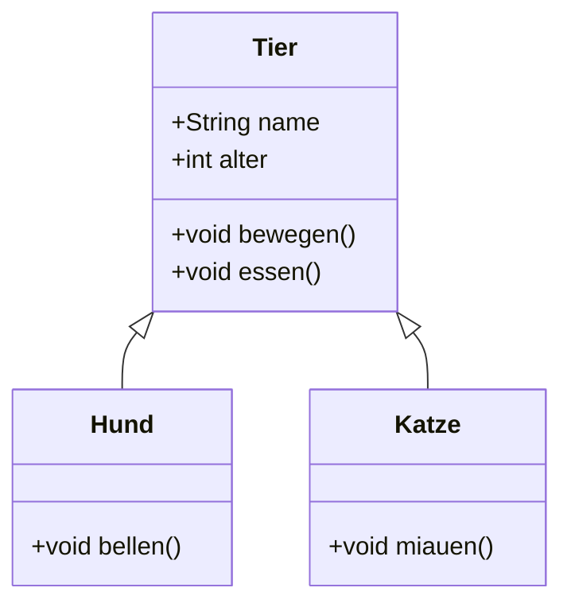
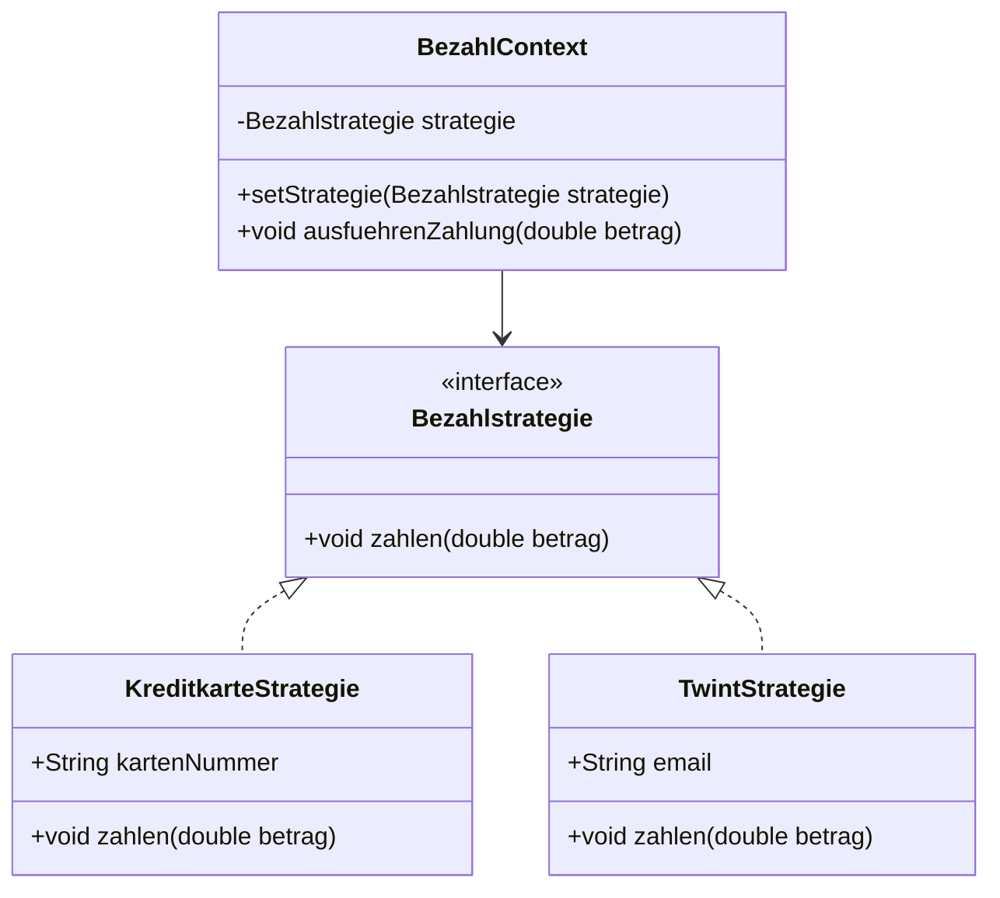
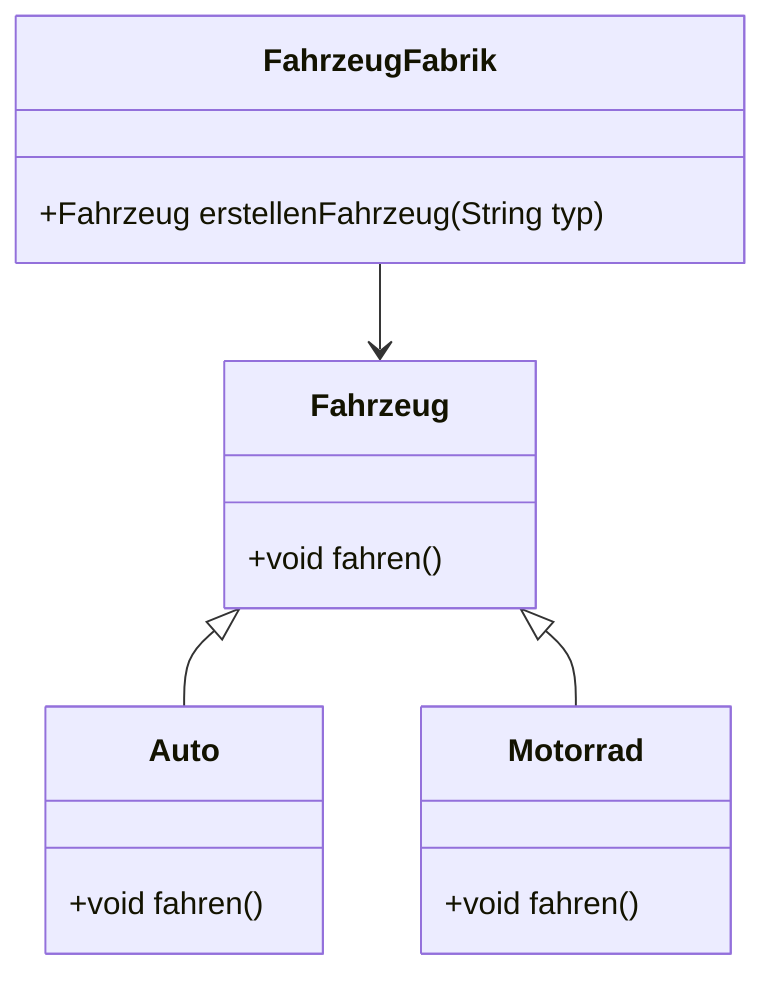
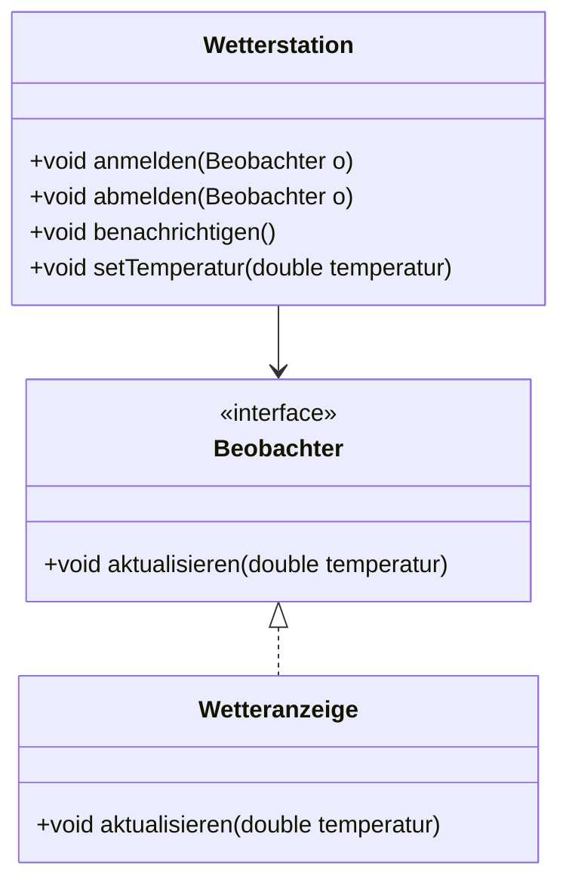

# UML Code Examples

## Beispiel 1: Tiere und ihre Fähigkeiten



```Java
class Tier {
    String name
    int alter

    // Konstruktor
    Tier(String name, int alter) {
        this.name = name
        this.alter = alter
    }

    void bewegen() {
        print("Das Tier bewegt sich.")
    }

    void essen() {
        print("Das Tier isst.")
    }
}

class Hund : Tier {
    Hund(String name, int alter) : super(name, alter)

    void bellen() {
        print("Der Hund bellt.")
    }
}

class Katze : Tier {
    Katze(String name, int alter) : super(name, alter)

    void miauen() {
        print("Die Katze miaut.")
    }
}

```

## Beispiel 2: Strategy Pattern - Bezahlmethoden



```Java
interface Bezahlstrategie {
    void zahlen(double betrag)
}

class KreditkarteStrategie : Bezahlstrategie {
    String kartenNummer

    KreditkarteStrategie(String kartenNummer) {
        this.kartenNummer = kartenNummer
    }

    void zahlen(double betrag) {
        print("Zahle " + betrag + " mit Kreditkarte: " + kartenNummer)
    }
}

class PayPalStrategie : Bezahlstrategie {
    String email

    PayPalStrategie(String email) {
        this.email = email
    }

    void zahlen(double betrag) {
        print("Zahle " + betrag + " mit PayPal: " + email)
    }
}

class BezahlContext {
    Bezahlstrategie strategie

    void setStrategie(Bezahlstrategie strategie) {
        this.strategie = strategie
    }

    void ausfuehrenZahlung(double betrag) {
        if (strategie != null) {
            strategie.zahlen(betrag)
        } else {
            print("Keine Bezahlstrategie gesetzt!")
        }
    }
}

// Beispielnutzung
BezahlContext context = new BezahlContext()
context.setStrategie(new KreditkarteStrategie("1234-5678-9876-5432"))
context.ausfuehrenZahlung(100.0)

context.setStrategie(new PayPalStrategie("user@example.com"))
context.ausfuehrenZahlung(50.0)

```

## Beispiel 3: Factory Pattern - Fahrzeugerstellung



```Java
class Fahrzeug {
    void fahren() {
        print("Das Fahrzeug fährt.")
    }
}

class Auto : Fahrzeug {
    void fahren() {
        print("Das Auto fährt auf der Strasse.")
    }
}

class Motorrad : Fahrzeug {
    void fahren() {
        print("Das Motorrad fährt auf der Strasse.")
    }
}

class FahrzeugFabrik {
    Fahrzeug erstellenFahrzeug(String typ) {
        if (typ == "Auto") {
            return new Auto()
        } else if (typ == "Motorrad") {
            return new Motorrad()
        } else {
            print("Unbekannter Fahrzeugtyp!")
            return null
        }
    }
}

// Beispielnutzung
FahrzeugFabrik fabrik = new FahrzeugFabrik()
Fahrzeug auto = fabrik.erstellenFahrzeug("Auto")
auto.fahren()

Fahrzeug motorrad = fabrik.erstellenFahrzeug("Motorrad")
motorrad.fahren()

```

## Beispiel 4: Observer Pattern - Wetterstation



```Java
interface Beobachter {
    void aktualisieren(double temperatur)
}

class Wetteranzeige : Beobachter {
    String name

    Wetteranzeige(String name) {
        this.name = name
    }

    void aktualisieren(double temperatur) {
        print(name + " zeigt neue Temperatur: " + temperatur + "°C")
    }
}

class Wetterstation {
    List<Beobachter> beobachterListe = []
    double temperatur

    void anmelden(Beobachter o) {
        beobachterListe.add(o)
    }

    void abmelden(Beobachter o) {
        beobachterListe.remove(o)
    }

    void benachrichtigen() {
        for (Beobachter o : beobachterListe) {
            o.aktualisieren(temperatur)
        }
    }

    void setTemperatur(double temperatur) {
        this.temperatur = temperatur
        benachrichtigen()
    }
}

// Beispielnutzung
Wetterstation station = new Wetterstation()
Wetteranzeige anzeige1 = new Wetteranzeige("Anzeige 1")
Wetteranzeige anzeige2 = new Wetteranzeige("Anzeige 2")

station.anmelden(anzeige1)
station.anmelden(anzeige2)

station.setTemperatur(25.5)
station.setTemperatur(30.0)

station.abmelden(anzeige1)
station.setTemperatur(28.0)

```
