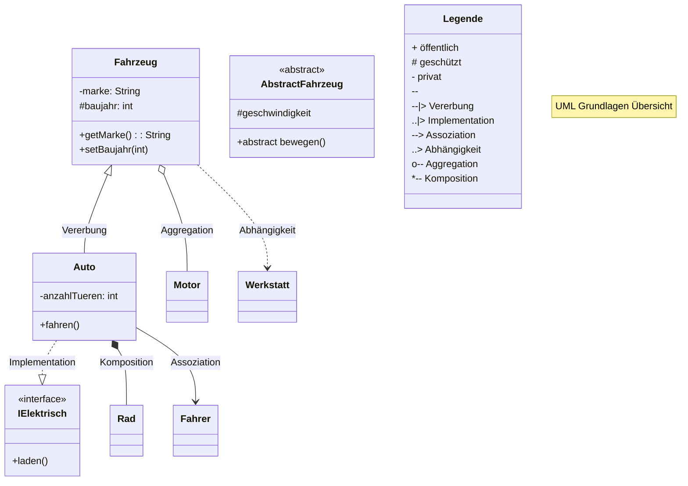
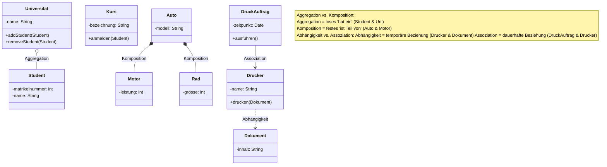

# UML Overview

```mermaid
classDiagram
    note "UML Grundlagen Übersicht"
    
    %% Klassen-Beispiele
    class Fahrzeug {
        -marke: String
        #baujahr: int
        +getMarke(): String
        +setBaujahr(int)
    }
    
    class Auto {
        -anzahlTueren: int
        +fahren()
    }
    
    class IElektrisch {
        <<interface>>
        +laden()
    }
    
    class AbstractFahrzeug {
        <<abstract>>
        #geschwindigkeit
        +abstract bewegen()
    }

    %% Beziehungen
    Fahrzeug <|-- Auto : Vererbung
    Auto ..|> IElektrisch : Implementation
    Fahrzeug o-- Motor : Aggregation
    Auto *-- Rad : Komposition
    Fahrzeug ..> Werkstatt : Abhängigkeit
    Auto --> Fahrer : Assoziation
    
    %% Weitere Klassen für Beziehungsbeispiele
    class Motor
    class Rad
    class Werkstatt
    class Fahrer

    %% Legende
    class Legende {
        + öffentlich
        # geschützt
        - privat
        --
        --|> Vererbung
        ..|> Implementation
        --> Assoziation
        ..> Abhängigkeit
        o-- Aggregation
        *-- Komposition
    }
```

## Aggregation/Komposition, Assoziation/Abhängigkeit

```mermaid
classDiagram
    %% Aggregation vs. Komposition Beispiel
    class Universität {
        -name: String
        +addStudent(Student)
        +removeStudent(Student)
    }
    class Student {
        -matrikelnummer: int
        -name: String
    }
    class Kurs {
        -bezeichnung: String
        +anmelden(Student)
    }
    
    %% Der Student existiert auch ohne Universität
    Universität o-- Student : Aggregation
    
    class Auto {
        -modell: String
    }
    class Motor {
        -leistung: int
    }
    class Rad {
        -grösse: int
    }
    %% Motor & Räder sind fest mit Auto verbunden
    Auto *-- Motor : Komposition
    Auto *-- Rad : Komposition
    
    %% Abhängigkeit vs. Assoziation Beispiel
    class Drucker {
        -name: String
        +drucken(Dokument)
    }
    class Dokument {
        -inhalt: String
    }
    class DruckAuftrag {
        -zeitpunkt: Date
        +ausführen()
    }
    
    %% Drucker nutzt temporär ein Dokument
    Drucker ..> Dokument : Abhängigkeit
    %% DruckAuftrag hat dauerhaften Bezug zum Drucker
    DruckAuftrag --> Drucker : Assoziation

    note "Aggregation vs. Komposition:
    Aggregation = loses 'hat ein' (Student & Uni)
    Komposition = festes 'ist Teil von' (Auto & Motor)
    
    Abhängigkeit vs. Assoziation:
    Abhängigkeit = temporäre Beziehung (Drucker & Dokument)
    Assoziation = dauerhafte Beziehung (DruckAuftrag & Drucker)"
```