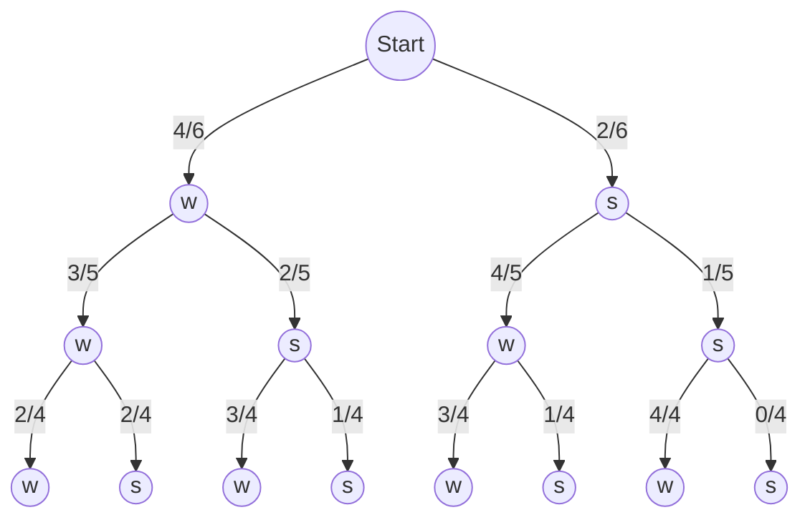
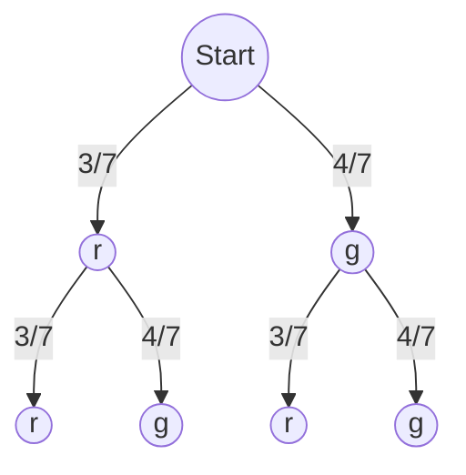

## Beispiel - ohne Zurücklegen

Gegeben ist ein Topf mit 4 weissen und 2 schwarzen Kugeln. Wir ziehen 3 Mal **ohne** Zurücklegen.

Modellierung: $\Omega$ = {w,s} x {w,s} x {w,s}

a) Was ist die Wahrscheinlichkeit für A: "Dritte Kugel weiss"?

Teilmenge von $\Omega$ ist A = {(w,w,w), (w,s,w), (s,w,w), (s,s,w)}

P(A) = f(w,w,w) + f(w,s,w) + f(s,w,w) + f(s,s,w)

$
P(A) = \frac{4}{6} * \frac{3}{5} * \frac{2}{4} + \frac{4}{6} * \frac{2}{5} * \frac{3}{4} + \frac{2}{6} * \frac{4}{5} * \frac{3}{4} + \frac{2}{6} * \frac{1}{5} * \frac{4}{4}
$

## Beispiel - mit Zurücklegen

Gegeben ist ein Topf mit 3 roten und 4 grünen Kugeln. Wir ziehen 2 Mal **mit** Zurücklegen.

Modellierung: $\Omega$ = {w,s} x {w,s} x {w,s}

Ereignis A: "Erste Kugel rot"

A = {(r,r), (r,g)}

Ereignis B: "Zweite Kugel rot"

A = {(r,r), (g,r)}

$
P(A \cap B) = P(\\{ (r,r) \\}) = \frac{3}{7} * \frac{3}{7}
$

$
P(A) * P(B) = (\frac{3}{7} * \frac{3}{7} + \frac{3}{7} * \frac{4}{7}) * (\frac{3}{7} * \frac{3}{7} + \frac{4}{7} * \frac{3}{7}) = \frac{3}{7} * \frac{3}{7}
$