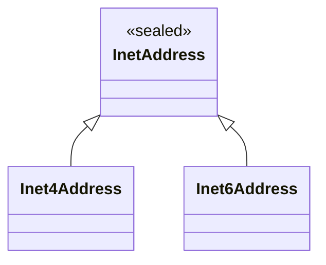

# Protocol & Network levels

## Protocol

– In order to exchange data a protocol must be defined
– Big success story: TCP/IP & UDP/IP protocols
    - TCP/IP Reference Model
– Link Protocols     ISO/OSI 1-2
    - Cable / Fiberglass  (Physical Layer)
    - Ethernet protocol (or ISDN / FDDI) (Data Link Layer)
– Internet Protocols   (Network Layer) ISO/OSI 3
    - IP protocol: addressing system, packet format, rules
about transmitting and receiving protocols (from host to host)
– Transport Protocols   (Transport Layer) ISO/OSI 4
    - TCP and UDP (transport data from application to application)
– Application Protocols    ISO/OSI 5-7
    - HTTP / FTP / SMTP / ...

## IP Socket connection

**Characteristics**

- Hostname / IP: uses by IP
- Port: used by TCP/UDP

**Service**

- On the server side a service must be waiting
for incoming requests (**on a particular port**)
– When the client connects to a server service
it discloses its own address & port in order
to receive a response

> Each network connection is identified by
> - incoming host and port
> - outgoing host and port

## IP Addressing

IP Address
– 32bit (IPv4) or 128-bit (IPv6) unsigned number used by IP
    - Address Types
– unicast 
    - An identifier for a single interface
    - A packet sent to a unicast address is delivered to the interface identified by 
that address.
    - Loopback addresses are the addresses assigned to the loopback interface. 
Anything sent to these IP addresses loops around and becomes IP input on 
the local host. These addresses are often used when testing a client.
– multicast 
    - An identifier for a set of interfaces (typically belonging to different nodes) 
    - A packet sent to a multicast address is delivered to all interfaces identified by 
that address

## TCP/UDP Common Port Numbers

### Port Numbers (http://www.iana.org/assignments/port-numbers)
    – Well known Ports 0..1023
    – User ports  1024 – 65535

### Examples

(user defined ports)

–  7        echo    tcp/udp Echo service  
– 13        daytime tcp/udp Returns day/time as string
– 17        qotd    tcp/udp Quote of the Day 
– 21        ftp     tcp 
– 22        ssh     tcp/udp SSH Remote Login Protocol 
– 23        telnet  tcp Interactive Session
– 25        smtp    tcp Simple Mail Transfer
– 37        time    tcp/udp Returns time in seconds since 1.1.1970
– 69        tftp    udp Simplified version of ftp (UDP based)
– 80        www     tcp World Wide Web HTTP

```bash
telnet www.google.ch 80
> GET / HTTP1.1....
> Host: www.fhnw.ch
```

## Java classed for networking

- Module: java.base
- Package: java.net
    - Provides the classes for implementing networking applications

- Low level APIs
    - Addresses
        - Inet4Address
        - Inet6Address
    - Interfaces
        - NetworkInterface
    - Sockets
        - Socket
        - ServerSocket
        - DatagramSocket

## InetAddress

### Static factory methods



```java
InetAddress getByName(String name)
// name or IP Address (as String)
// primary IP-Address for a name
InetAddress getByAddress(byte[] addr)
InetAddress[] getAllByName(String host)
InetAddress getLocalHost()
InetAddress getLoopbackAddress()
```

### Instance methods

```java
byte[] getAddress()
String getHostAddress()
String getHostName()
String getCanonicalHostName()   fully qualified host name
boolean isReachable(int timeout)   ICMP Echo Request / Echo (port 7)
boolean isMulticastAddress()
boolean isLoopbackAddress()
```

### Network interfaces

Network Interfaces and its addresses

```java
public static void main(String[] args) throws SocketException {
   Enumeration<NetworkInterface> interfaces = 
                     NetworkInterface.getNetworkInterfaces();
   while(interfaces.hasMoreElements()){
      NetworkInterface intf = interfaces.nextElement();
        
      System.out.print(intf.getName());
      System.out.println(" ["+intf.getDisplayName()+"]");
        
      Enumeration<InetAddress> adr = intf.getInetAddresses();
      while(adr.hasMoreElements()) {
         System.out.println("\t" + adr.nextElement());
      }
      byte[] hardwareAddress = intf.getHardwareAddress();
   }
}
```

### TCP Socket

**Stream Socket**

– Permanent & reliable connection between a machine A and a machine B
    - Packages are delivered in correct order
    - Lost packages are retransmitted
– A Socket is identified by Hostname/IP and port number
– Connection to a server is full-duplex
    - The programs can “talk to each other”
    - The Socket establishes an input- and output stream
– After transmission one or both sides close the connection
– Lowest-level form of communication from application developer’s view
    - Programmer is responsible for managing the flow of bytes between machines
    - Higher-level techniques:
    - Message passing systems (AMQP, MQTT, Akka, ...)
    - Extensions to Web Servers (HTTP, REST, ...)


#### Socket constructors

```java
Socket(InetAddress addr, int port)
Socket(InetAddress addr, int port, InetAddress localAddr, 
                                                     int localPort)
Socket(String host, int port)
Socket(String host, int port, InetAddress localAddr, int localPort)
Socket()       // creates unconnected Socket
  // => use connect method to bind to an address
```

#### Socket methods

```java
InetAddress getInetAddress() // address/port to which the
int getPort()   // socket is connected
InetAddress getLocalAddress() // address/port to which the
int getLocalPort()  // socket is bound
InputStream getInputStream()
OutputStream getOutputStream()
void close()
void shutdownOutput()  // disables output stream
void shutdownInput()  // closes input stream
connect(SocketAddress endpoint)  // used for unconnected streams
connect(SocketAddress endpoint, int timeout)
bind(SocketAddress bindpoint) // binds socket to a local address
```

#### Example: Simple client

```java
public class Daytime {
   public static void main(String[] args) throws Exception {
        try (Socket s = new Socket("time-a-b.nist.gov", 13)) {
            InputStream in = s.getInputStream();
            int ch = in.read();
            while (ch != -1) {
                System.out.print((char) ch);
                ch = in.read();
            }
        }
    }
}
```

#### Example: Simple client echo

```java
public class Echo {
   public static void main(String[] args) throws Exception {
      Socket s = new Socket("86.119.38.130", 7);
      PrintWriter out = new PrintWriter(s.getOutputStream());
      BufferedReader in = new BufferedReader(
                  new InputStreamReader(s.getInputStream()));
      BufferedReader stdin = new BufferedReader(
                  new InputStreamReader(System.in));
      String input = stdin.readLine();
      while(input != null && !input.equals("")){
         out.println(input); out.flush();
         System.out.println("Echo: " + in.readLine());
         input = stdin.readLine();
      }
      s.close();
   }
}
```

#### Example: Simple client mailer

```java
public class Mailer {
   private static Scanner in;
   private static Writer  out;
 
   public static void main(String[] args) throws Exception {
      // open Socket to server using smtp
      // args[0] must contain reference to mail server
      Socket s = new Socket(args[0], 25);
      // open Scanner and PrintWriter on Socket
      in  = new Scanner(s.getInputStream());
      out = new PrintWriter(s.getOutputStream(), true);
  
      // Determine name of local host
      String hostName = InetAddress.getLocalHost().getHostName();
      System.out.println(hostName);


      receive(); send("HELO " + hostName);
      receive(); send("MAIL FROM: <juerg.christener@fhnw.ch>");
      receive(); send("RCPT TO: <dominik.gruntz@fhnw.ch>");
      receive(); send("DATA");
      receive(); send("To: dominik.gruntz@fhnw.ch");
                 send("Subject: Meeting");
                 send("Meeting um 11:30. Thema Rekurs vesys!");
                 send(".");
      receive(); s.close();
   }
   private static void receive() throws IOException {
      if(in.hasNext()){
         System.err.println(in.nextLine()); // print in red
      }
   }
   public static void send(String s) throws IOException {
      out.write(s.replaceAll("\n", "\r\n")); out.write("\r\n");
   }
}
```

### Server Socket

**ServerSocket**

– Runs on a server and listens for incoming calls
– Bound to an IP Address and a port
– Only one process may listen on one port


**Backlog**

– The OS stores incoming connections not yet accepted in a FIFO queue
– The default length of this queue is **50** in Java, 
but cannot exceed OS limits
    - Linux: /proc/sys/net/ipv4/tcp_max_syn_backlog

```bash
> cat /proc/sys/net/ipv4/tcp_max_syn_backlog
1024
```

#### Definitions

**ServerSocket**

```java
ServerSocket(int port)  // opens a listener on a specific port,
    // 0 for a system allocated port number
    // can be queried with getLocalPort()
ServerSocket(int port, int backlog)
ServerSocket(int port, int backlog, InetAddress bindAddr)
               // for a multihomed server, only 
               // accepts request on bindAddr
ServerSocket()  // has to be bound using method bind
```

**Connections**

```java
Socket accept()   // blocks until a connection is requested
setSoTimeout(int millis) // timeout for accept
```

#### Examples

**EchoServer**

```java
public class EchoServer {
   public static void main(String args[]) throws IOException {
      try (ServerSocket server = new ServerSocket(1234)) {
         while (true) {
            Socket s = server.accept();
            BufferedReader in  = new BufferedReader(
                 new InputStreamReader(s.getInputStream()));
            PrintWriter    out = new PrintWriter(
                                       s.getOutputStream(), true);
   
            String input = in.readLine();
            while(input != null && !"".equals(input)) {
               out.println(input); input = in.readLine();
            }
            System.out.println("done serving "+s);
            s.close();
         }
}  }  }
```

**EchoServer2**

```java
public class EchoServer {
   public static void main(String args[]) throws IOException {
      try (ServerSocket server = new ServerSocket(1234)) {
         while (true) {
            try(var s = server.accept()) {
               BufferedReader in  = new BufferedReader(
                    new InputStreamReader(s.getInputStream()));
               PrintWriter    out = new PrintWriter(
                                          s.getOutputStream(), true);
   
               in.lines().forEach(line -> {
                  out.println(input); 
                  System.out.println(">> " + line);
               }
            }
            System.out.println("done serving "+s);
         }
}  }  }
```

#### Concurrent Echo server


- Problem: Server can serve at most one client
- Solutions:
    – Thread-per-client
        - After accept returns a socket, start a new thread which answers this request and immediately call accept again
    – Thread-pool
        - Start n threads where each handles client by client
        - Multiple threads may call accept simultaneously on the same server socket. Upon a connection request, one thread is selected.
    – Thread-pool from java.util.concurrent package
        - Executors / ExecutorService
    – NIO
    – Virtual Threads

**EchoServer2 threaded**

```java
public class EchoServer2 {
   public static void main(String args[]) throws IOException {
      try (ServerSocket server = new ServerSocket(1234)) {
      
         while (true) {
            Socket s = server.accept();
 
            Thread t = new Thread(new EchoHandler(s));
            t.start();
         }
      }
   }
}
```

In den Folien folgen noch andere thread Beispiele.
