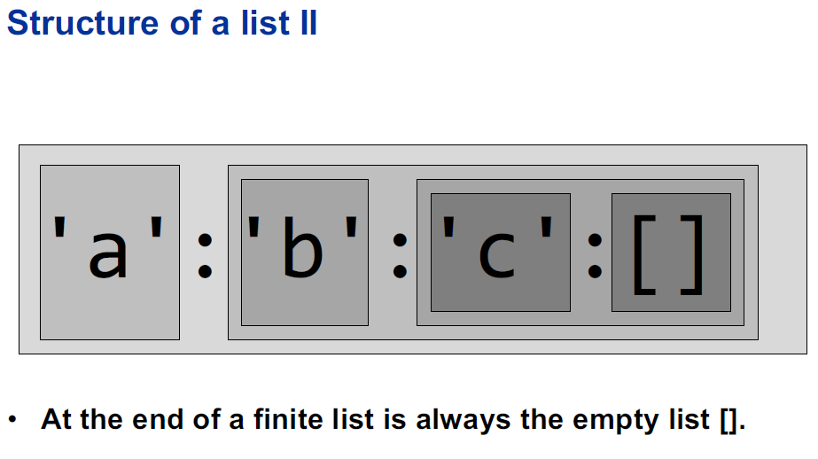

A list is a sequence of elements of the **same type**.

```
[1, 2, 3, 4] :: [Int]
...
[sum, product] :: [ [Int] -> Int ]
...
[[1], [2,3,4]] :: [[Int]]
```

### List vs Tuples

List
- sequence of elements of the same type
- one Type for all elements
- Length: The number of elements in a
- List of the same type can have different lengths


Tuple
- finite sequence of components of possibly different type
- Arity: The number of components in a tuple
- All tuples of the same type have the same arity

```haskell
head :: [a] -> a
head ['a', 'b', 'c'] ~> 'a'

tail :: [a] -> [a]

-- Access second element of a list a
head (tail [1, 2, 3]) ~> 2
```

### Cons (:) - prepend element in front of list

```haskell
(:) :: a -> [a] -> [a]
'a' : ['b', 'c'] ~> ['a', 'b', 'c']
-- same as:
(:) 'a' ['b', 'c']
```




```shell
ones = 1 : ones
ones -- prints infinit 1

take 100 ones -- shows first 100 elements of a list
```

### Head in Detail

```haskell
head []
tail []

-- bots returns an exception: empty list

null [] ~> True
length [1,2,3] ~> 3 -- but null is more efficient

type String = [Char]
head "hello" ~> 'h'


```


### Pattern matching Lists

```haskell
stdMatch [] = "Matched empty List"
stdMatch [x:xs] = "Matched list with head " ++ show x
stdMatch [1,2,3,4] ~> "Matched list with head 1"

ml [x] = "Matched list with ont element"
ml [x,y] == "Matched list with two elements"

ml' (x:[]) = "Matched list with one element"
ml' (x:y:[]) = "Matched list with two elements" 
```

### List functions

```haskell
zip [1..] "abcd" ~> [(1,'a'),(2,'b'),(3,'c'),(4,'d')]
```

### Filter and map

```haskell
filter even [2,3,4,5,6] ~> [2,4,6]
filter odd [2,3,4,5,6] ~> [3,5]
filter (\s -> length s > 2) ["ab", "abc", "a"] ~> ["abc"]

map times2 [1,2,3,4] ~> [2,4,6,8]
map fst [(1, "a"), (2, "b"), (6, "f")] ~> [1,2,6]
map head ["abcd", "c", "xyz"] ~> "acx" -- [Char]
```

```haskell
data Quality = Good | Bad

isGood :: (Quality,a) -> Bool
isGood (Good,_) = True
isGood (Bad,_) = False

q11 = map snd 
  (filter isGood 
    (zip [Good, Bad, Good] ["a", "b", "c"]))

q11 ~> ["a","c"]
```

### Wildcard matcher

```haskell
f7 (_ : a : _ : c) = a : c -- whitespaces are necessary for proper syntax highlighting
q7 = f7 [1,2,3,4,5]

q7 ~> [2,4,5]
```

Was würde hier matchen?
```haskell
f8 (_,a,_,c) = a : c
q8 = f8 [1,2,3,4,5]
> error!

-- f8 matches only lists with?!
```

### isLower function

```haskell
Prelude> import Data.Char
Prelude Data.Char> :t isLower
isLower :: Char -> Bool
```

```haskell
q12 = filter isLower (concat ["AbC", "dEf", "GHI"])
q12 ~> "bdf"
```

### sum on map

```haskell
q13 = sum (map maximum [take 2 [1,4,9], drop 1[10,9,4]])
q13 ~> 13

-- step by step

> [take 2 [1,4,9], drop 1[10,9,4]]
[[1,4],[9,4]]

> maximum [take 2 [1,4,9], drop 1[10,9,4]]
[9,4]

> map maximum [take 2 [1,4,9], drop 1[10,9,4]]
[4,9]
```