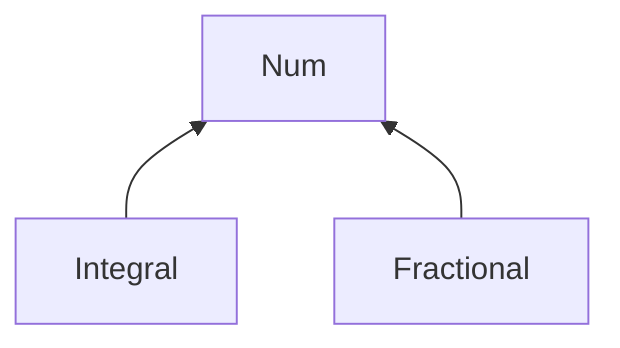

## Introduction

For function overloading...

```haskell
> :t max
max :: Ord a => a -> a -> a

-- Ord is a class constraint "only a"
```

## Basic classes

### Eq - equality types
- Contains types whose values can be compared for equality and inequality
- methods: (==), (/=)

### Ord - ordered types
- Contains types whose values are totally ordered
- methods: (<), (<=), (>=), min, max

### Show - showable types
- Contains types whose values can be converted into strings of characters
- methods show :: a -> String

```haskell
:{
instance Show ABC where
show A = "AA"
show B = "BB"
show C = "ZCZ"
:}

> A
AA
it :: ABC

> C
ZCZ
it :: String
```

### Num - numeric types
- Contains types whose values are numeric
- methods: (+), (-), (*), negate, abs signum

### Integral - integral types
- Contains types that are numeric but of integral value
- methods: div, mod

### Fractional - fractional types
- Contains types that are numeric but of fractional value
- method: (/), recip



### Examples

```haskell
> max 'a' 'f'
'f'
it :: Char

-- Convert from Int / Integer back to Num
fromIntegral :: (Integral a, Numb b) => a -> b

> fromIntegral (3 :: Int) / 1.5
2 :: Fractional a => a
```