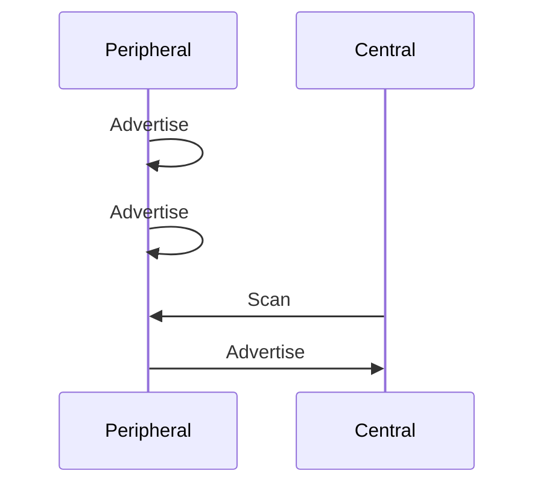
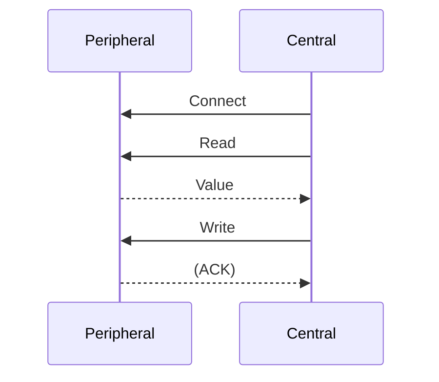
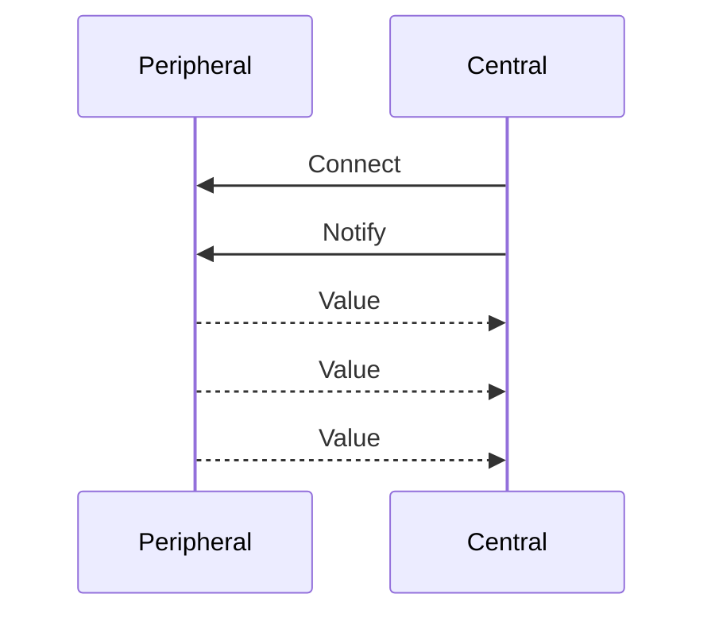

# Blauzahn :D

### BLE Protocol Stack

[learn.adafruit ](https://learn.adafruit.com/introduction-to-bluetooth-low-energy/gatt)

- Application - application specific code and formats
- BLE library - thin, language-specific wrapper library
- [GATT](https://www.bluetooth.com/specifications/specs/?types=adopted) - services & characteristics | GAP - discovers
- ATT - attribute transport | SMP - security manager
- L2CAP - logical link control and adaption protocol

### Generic Access Profile (GAP)

Defines the roles:
- Broadcaster and Observer (connectionless, one-way)
- Peripheral and central (bidirectional connection)

Each device can support just one or more of these roles.

### Advertising

Perisperals advertises its services by broadcast (in a regular interval). A central scanns for all or a subset of servies that it's interested in and gets device addresses and if available, advertised data (if sent by peripheral).

### Attribute Transport (ATT)

ATT allows a client to access attributes on a server. 

Attribute:
- handle: server assigned, 16bit ID
- UUID: 16/128bit universal unique identifier
- Permissions: read, write, notified

### Generic Attribute Profile (GATT)

GATT is a simple application level protocol for BLE, connection-based with a client and a server role.

[List of specs](https://www.bluetooth.com/specifications/specs/)

#### GATT Services

A GATT service is a collection of characteristics that encapsulate the behavior of a part of a device.

There are standard and custom services and profiles.

#### GATT Characteristics

GATT characteristic:
- value: encodes data "bits" that form a logical unit
- descriptors: defined attributes of a characteristic

Supported procedures (same as permissions): read, write, notified

#### GATT Descriptors

Describes a characteristic value e.g. Presntation format or value range descriptor.

Descriptors also allow to configure characteristics e.g. client characteristic configuration descriptor allows a client to enable or disable notifications.

### Read and write

- Connect: central connects to a peripherals BLE address
- Read: value of a characteristic or its descriptors is returned
- write: characteristic value or characteristic descriptor value is set, with or without response.

## Notifications

- Notify: Client characteristic configuration descriptor of a characteristic, UUID 0x2902, is set to 0x0001 using Write.
- Value: A Handle value notification is sent if value changes

## Heart rate services example

[Heart Rate Service 1.0 - UUID (16-bit): 0x180D](https://www.bluetooth.com/specifications/specs/heart-rate-service-1-0/)

This service includes the following characteristics:
- Heart Rate Measurement UUID: 0x2A37 [N]
- Body Sensor Location UUID: 0x2A38 [R]
- Heart Rate Control Point UUID: 0x2A39 [W]

## Nordic UART service

[Nordic Link](https://developer.nordicsemi.com/nRF_Connect_SDK/doc/latest/nrf/libraries/bluetooth_services/services/nus.html)

Characteristics:
- RX, receiving data: UUID: 0x0002 (W)
- TX, transmitting data: UUID: 0x0003 (N)

## Beacons

[Apple iBeacon](https://developer.apple.com/ibeacon/Getting-Started-with-iBeacon.pdf) or [Physical Web](https://google.github.io/physical-web/) / [Eddystone](https://github.com/google/eddystone) beacons

- Just advertising data

## Security

Security mechanisms for pairing and transmitting.

[Video](https://www.bluetooth.com/de/bluetooth-resources/intro-to-bluetooth-security-part1/)

[Study Guide](https://www.bluetooth.com/de/bluetooth-resources/le-security-study-guide/)

## Device API vs. SDK

Device API:
- Specified how to talk to the device (from any client e.g. via BLE)

Platform SDK:
- is platform specific
- simplified the integration

## Signal strength - dB (decibel)

dB describes the signal strength or power levels. It quantifies the received signal strength and can be important in determining the quality of the connection.

**Received Signal Strength (RSSI)**

- A higher value indicates a stringer signal
- the value is expressed in negative db values
- -30 dB indicates a very strong signal
- -90 dB indicates a very weak signal

There are a few indicators for good or bad RSSI signals:
- Signal Quality
- Link Quality
- Range Estimation
- Signal Interference