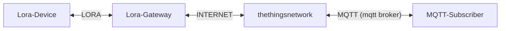

(Around 1 km in cities, 10+ km in open terrain)

[Gateway-Map](https://www.thethingsnetwork.org/community#list-communities-map)

[thethingsnetwork](https://www.thethingsnetwork.org/)

[Loriot.io](https://loriot.io/)

[TTN Map](https://ttnmapper.org/heatmap/)

# Terminology

- Node — device with sensors, LoRaWAN connectivity.
- Gateway — LoRa (to Internet, i.e. TCP/IP) gateway.
- Network server — LoRaWAN specific backend.
- Application server — application backend.

# Frequency

EU 868 MHz, US 915 MHz, Asia 433 MHz, …

[frequency plans](https://www.thethingsnetwork.org/docs/lorawan/frequency-plans/)

[frequency plan per country](https://www.thethingsnetwork.org/docs/lorawan/frequencies-by-country/)

# LoRaWAN gateways

Gateways forward uplink data packets to the backend.
There, they are deduplicated & routed to applications.
Downlink packets are "broadcast" to nearby devices.
No license is required* to run a LoRaWAN gateway.

# LoRaWAN security

LoRaWAN transport [security](https://lora-alliance.org/resource_hub/lorawan-security-whitepaper/) is based on 128 bit keys:
Network Session Key — admits a device to a network.
Application Session Key — encrypts/decrypts payload.
These keys can be static or generated for each session.

### Over The Air Activation (OTAA)

OTAA uses an app key to generate keys per session.
- Device has a DevEUI, AppEUI and AppKey
- Device sends a Join Request, uses Join Response
  and AppKey to derive an AppSKey and NwkSKey
- Device must be able to store the generated keys
- Join decision can be delegated to a Join Server

### Activation by Personalization (ABP)

ABP uses static app session and network session keys.
- Device has a Device Address, AppSKey & NwkSKey
- No DevEUI, AppEUI or AppKey is needed here
- There is no Join, the device just sends data
- Overall ABP is simpler, but less flexible
- Changing the provider is not possible

# Register device

## Registering an application on TTN

An application is required to add devices later on,
grouping devices with the same payload format.
- Open the [TTN console for Europe](https://eu1.cloud.thethings.network/console/) (eu1)
- Go to Applications > Add application
- Enter an Application ID, e.g. fhnw-iot
- Click Create application

## Registering a device on TTN
- Open the TTN console for Europe (eu1)
- Go to Applications > click, e.g. fhnw-iot
- Click Add end device > Manually
- Set freq. EU recommended, version MAC V1.0.3
- Click Show advanced activation
- Choose either OTAA or ABP*
- Do not yet click register

JoinEUI: AppEUI 64bit UUID

### Getting ABP keys on TTN
If you're in the process of registering an ABP device:
- Click Generate on DevEUI, AppSKey and NwkSKey
- Click the refresh icon to generate a Device address
- Set an End device ID, e.g. fhnw-iot-device-0
- Click Register end device, then for the same device
- Go to General settings > Network layer >
  Advanced MAC settings > Reset frame counters [x]

### Arduino LoRaWAN with LMIC library
These examples work on nRF52840 and ESP8266.
They run LMIC to use the RFM95W LoRa module.
Install the MCCI LMIC library in the Arduino IDE.
Edit Arduino/libraries/MCCI_LoRaWAN_LMIC_
library/project_config/lmic_project_config.h

```#define CFG_eu868 1 //#define CFG_us915 1```

# Uplink and downlink
Uplink — sending data from a device to the backend.
Downlink — sending from the backend to a device.
There's an asymmetry due to duty cycle limitations.
Gateways are half-duplex, they either send or listen.
LoRaWAN is better suited to send data to the cloud.

## downlink

device > messaging > downlink > payload

bytes: "41 42 43"


## MQTT integration

The TTN backend offers an [MQTT broker](https://www.thethingsindustries.com/docs/integrations/mqtt/) API.

To get uplink packets from a device:
```bash
mqtt sub -t "v3/<AppID>@ttn/devices/<DevID>/up"\
-h "eu1.cloud.thethings.network" -u "<AppID>@ttn"\
-P "<ApiKey>" # see TTN console > Integrations > MQTT
```

To send a packet downlink, to a device:
```bash
mqtt pub -t "v3/<AppID>@ttn/devices/<DevID>/down/push"\
 -m '{"downlinks":[{"f_port":1,"frm_payload":"<Base64>",\
"priority": "NORMAL"}]}' -h … -u … -P … # as above
```

## Overview



## Data formats
Bandwidth is very limited, payload is ≤ 51 Byte.
JSON or plain ASCII formats use too much space:
{"temperature":20.63} vs. 20.63 vs. 0x080F
TTN allows to use JS payload decoders & encoders.
A binary format suitable for LoRa is CayenneLPP.

## Limitations
LoRaWAN has physical, legal & operator limitations:
Duty cycle limitations allow only 1% air time in EU*,
apply to nodes and gateways, creating asymmetry.
The TTN Fair Use Policy limits uplink air time to 30s
and downlink to 10 messages per 24h per node.
*See ETSI EN300.220 standard, 7.2.3.
