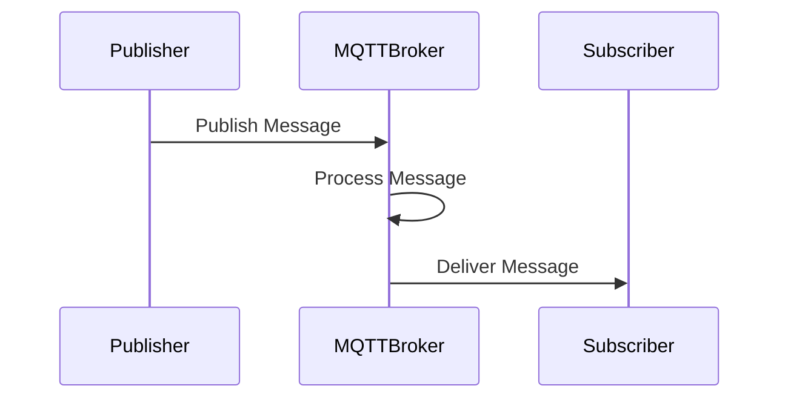
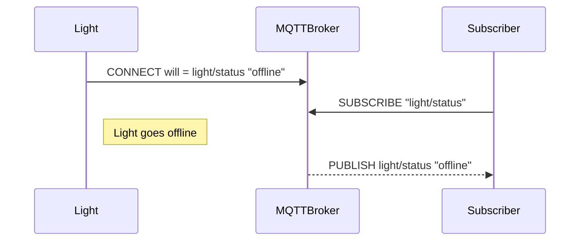

## Protocol overview



MQTT uses messages that are delivered in a specific channel. If used with a broker these channels are called topics.

## General

### Ports

- standard: 1883
- tls: 8883

### Topic structure

```bash
home
  /rooms/ROOM_ID
    /lights/LIGHT_ID
         /status "on"
         /color "255,0,64"
    /sensors/SENSOR_ID
         /temperature "23.0"
         /humidity "42"
```

### Topic wildcard

**+**: one topic layer like "a/+/c" would match: "a/b/c" or "a/x/c"<br>
**#**: entire topic layer like "a/#/" would match: "a/b/" or "a/x/", "a/x/y/z/"


### Quality of Service

Clients indicate desired QoS when publishing.
- QoS 0 — At most once delivery
- QoS 1 — At least once delivery
- QoS 2 — Exactly once delivery*


### Will message

MQTT allows to set a "last will" when connecting. 
The client specifies a will topic and a will message.
The will is published as soon as the client is offline.



### other featues

- Reason code in the case of errors, on CONNACK.
- Payload format and content type, MIME type.
- Session expiry interval, from disconnect.
- Data formats: CSV, JSON, Binary formats e.g. Protobuf


### Nodejs mqtt

```bash
npm install mqtt
npm install mqtt -g

mqtt sub -t "mytopic" -h "test.mosquitto.org"
mqtt pub -t "mytopic" \
-h "test.mosquitto.org" \
-m "Hello, world!"
```


## Node example

Sub client

```javascript
const mqtt = require("mqtt");

const broker = "mqtt://test.mosquitto.org/";
const client = mqtt.connect(broker);

client.on("connect", () => {
  const topic = "hello";
  client.subscribe(topic);
});

client.on("message", (topic, message) => {
  console.log(message.toString());
});
```

Pub client

```javascript
const mqtt = require("mqtt");

const broker = "mqtt://test.mosquitto.org/";
const client = mqtt.connect(broker);

client.on("connect", () => {
  const topic = "hello";
  const message = "Hello, World!";
  client.publish(topic, message);
});
```

## ESP8266 Example

```C
#include <ESP8266WiFi.h>
#include <ESP8266MQTTClient.h>

const char *ssid = ""; // TODO
const char *password = ""; // TODO

MQTTClient client;

void handleConnected() {
  Serial.println("Connected to broker");
  client.subscribe("leontest");
}

void handleSubscribed(int topicId) {
  Serial.println("Subscribed");
}

void handleDataReceived(String topic, String data, bool b) {
  Serial.print("Received topic: ");
  Serial.print(topic);
  Serial.print(", data: ");
  Serial.println(data);
}

void setup() {
  Serial.begin(115200);
  Serial.print("\nConnecting to network ");
  Serial.println(ssid);
  WiFi.mode(WIFI_STA);
  WiFi.begin(ssid, password);
  while (WiFi.status() != WL_CONNECTED) {
    delay(100); // keeps watchdog happy
  }
  Serial.print("Connected to network, local IP = "); 
  Serial.println(WiFi.localIP());

  client.onConnect(handleConnected);
  client.onSubscribe(handleSubscribed);
  client.onData(handleDataReceived);
  client.begin("mqtt://test.mosquitto.org/");
}

void loop() {
  client.handle();
}
```

## Local mqtt broker

```bash
sudo apt-get update
sudo apt-get install mosquitto # port 1883

# $SYS/broker/clients/connected 
```

## JSON Format and Protobuf

[JSON](https://www.json.org/json-en.html)

```json
{"t":22.04}
```

TODO...
