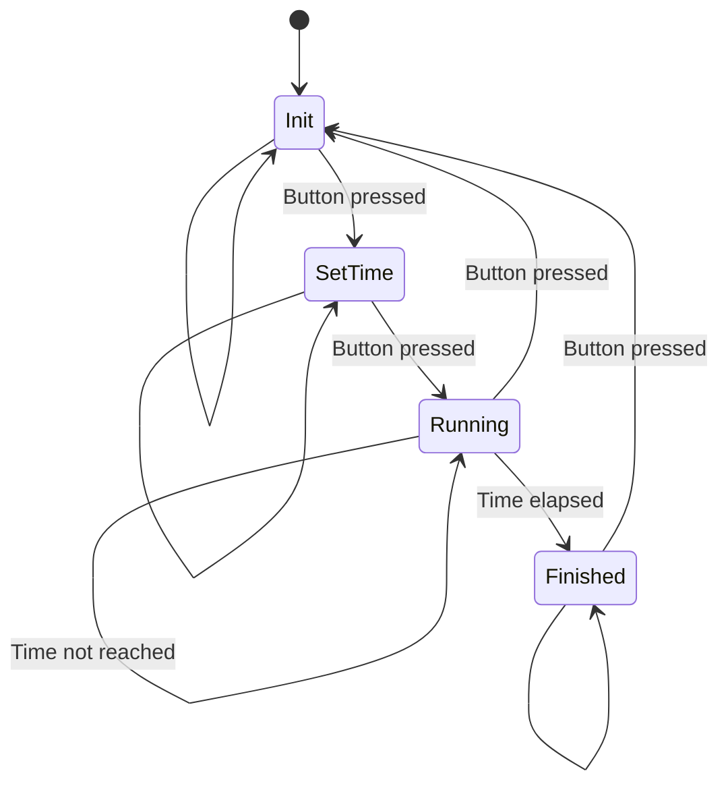

### Version 1.0



### Code

```C
// TODO
```


---

## Siehe auch

- → [State Machine](/docs/iot/hands-ons/state-machine) – Zustandsautomat als Grundmuster für Sketches
- → [Button Snippet](/docs/iot/snippets/button) – Taster einlesen
