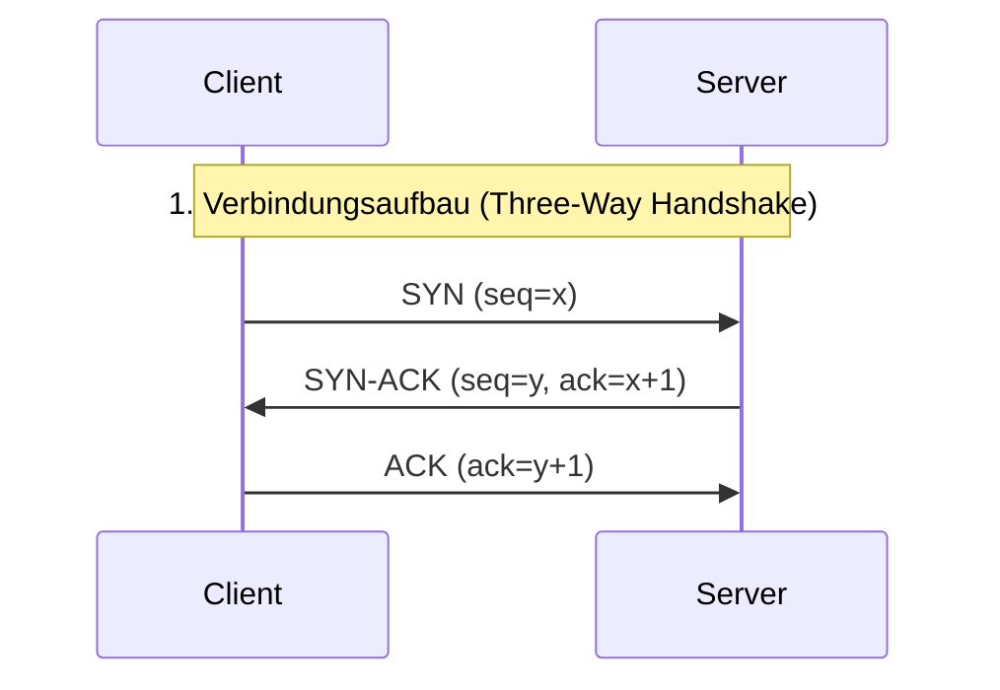
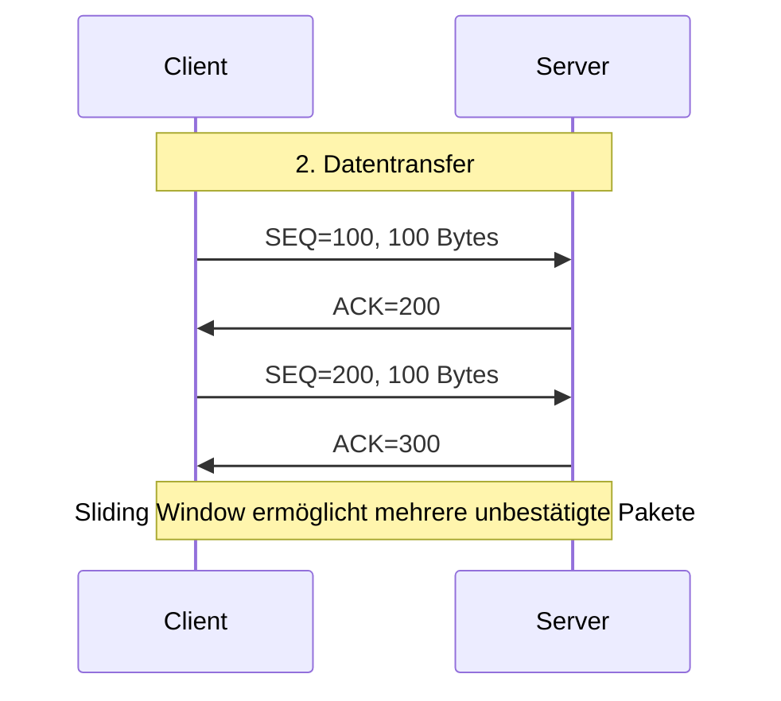
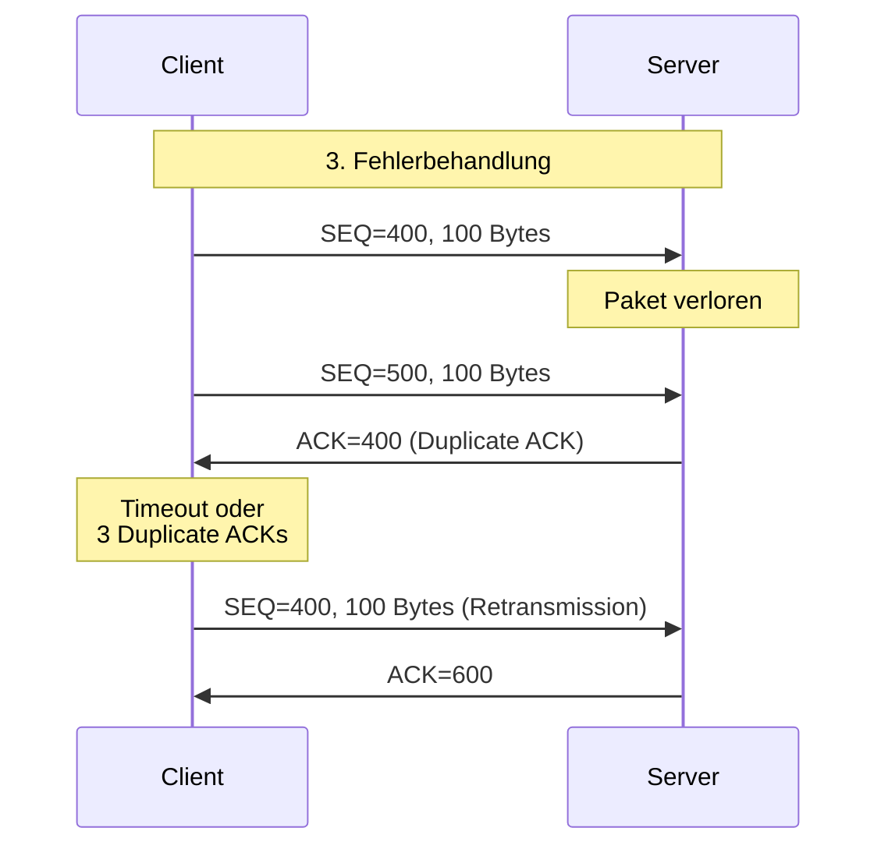
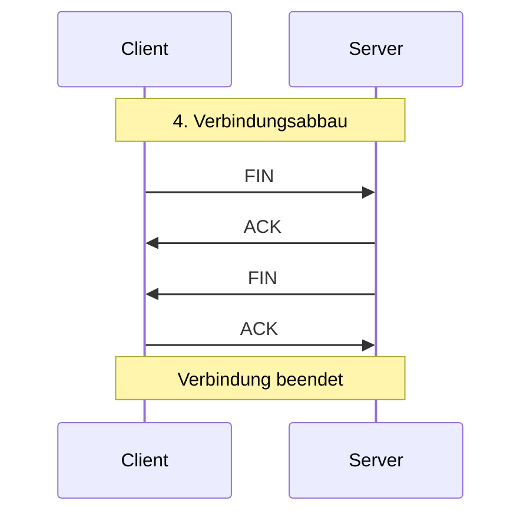

# TCP IP

## TCP-Verbindungsaufbau (Three-Way-Handshake)

## TCP-Datentransfer

## TCP-Fehlerbehandlung

## TCP-Verbindungsabbau (Four-Way-Handshake)

## Überlaststeuerung (Congestion Control)

Die an der Datenübertragung beteiligten Kommunikationspartner, in der Regel Client und Server, wissen nicht, wie viel Übertragungskapazität auf der Übertragungsstrecke zur Verfügung steht.

Angenommen, Sender und Empfänger seien beide an Gigabit Ethernet Schnittstellen
angeschlossen. Irgendwo auf dem Weg dazwischen sei aber ein viel langsamerer Link
(z.B. 64 kbit/s). Wie merkt der Sender, dass er Daten nur mit der Bandbreite des
langsamen Links schicken kann?

Der Sender erkennt die verfügbare Bandbreite durch TCP's Überlastkontrolle (Congestion Control). Hier ist der Ablauf:

1. TCP's Überlastkontrolle basiert auf dem Prinzip der Paketverluste und Verzögerungen:

2. Was passiert:
- Wenn der Sender Daten mit 1 Gbit/s sendet, aber der langsamste Link nur 64 kbit/s verarbeiten kann, stauen sich die Pakete in den Routern vor dem langsamen Link
- Die Router-Puffer füllen sich
- Wenn die Puffer voll sind, werden neue Pakete verworfen
- Diese Paketverluste interpretiert TCP als Überlastung (Congestion)

3. TCP's Reaktion:
- Bei Paketverlusten reduziert TCP seine Senderate (Congestion Window wird verkleinert)
- Bei erfolgreicher Übertragung erhöht TCP die Rate langsam wieder (Slow Start bzw. Congestion Avoidance)
- Dieser Prozess pendelt sich auf die verfügbare Bandbreite ein

4. Zusätzliche Indikatoren:
- Steigende Round-Trip Times durch gefüllte Puffer (Bufferbloat)
- Verzögerte oder doppelte ACKs
- Explicit Congestion Notification (ECN), falls unterstützt

Durch diesen Mechanismus passt sich TCP automatisch an die langsamste Verbindung der Strecke an, auch wenn Sender und Empfänger selbst an schnelleren Links angeschlossen sind.

## Datenrate berechnen

**Beispiel:**

1. Die maximale TCP-Datenrate wird durch folgende Formel bestimmt:
   Maximale Datenrate = Fenstergrösse / Round-Trip Time

2. Gegeben:
    - Round-Trip Time (RTT) = 100 ms = 0,1 Sekunden
    - Maximale Fenstergrösse ohne Window Scaling = 65535 Bytes (nicht 65636)

3. Berechnung:
   Maximale Datenrate = 65535 Bytes / 0,1 Sekunden
   = 655350 Bytes pro Sekunde
   ≈ 5,24 Megabytes pro Sekunde
   ≈ 41,94 Megabit pro Sekunde

Die maximale theoretische Datenrate beträgt also etwa 41,94 Mbit/s, 
unabhängig von der tatsächlich verfügbaren Bandbreite der Verbindung.
Dies zeigt eine wichtige Einschränkung des TCP-Protokolls ohne Window Scaling: 
Selbst wenn die physikalische Leitung eine höhere Bandbreite erlauben würde, 
kann TCP ohne Window Scaling diese nicht ausnutzen.

Deshalb wurde Window Scaling als Erweiterung eingeführt, 
um höhere Durchsatzraten auf Verbindungen mit hohem Bandwidth-Delay-Produkt zu ermöglichen.

