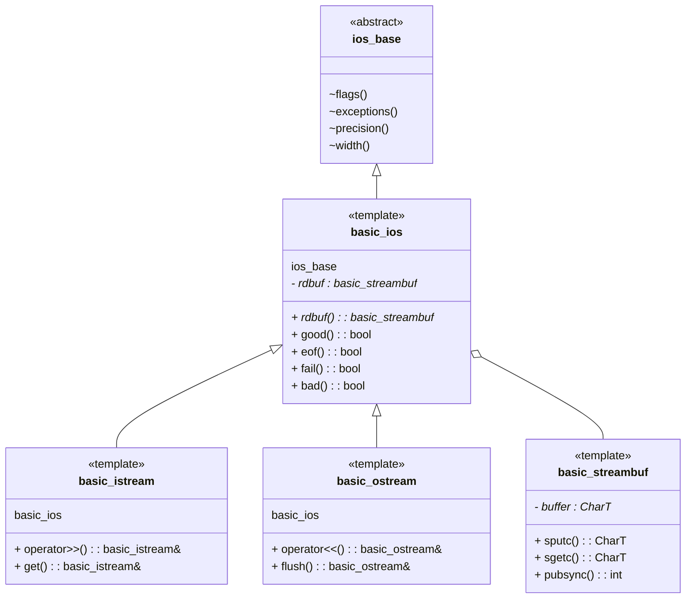

## Klassenübersicht




In der `ios_base` sind alle Statusflags inform von Bits enthalten wie zum Beispiel: good, bad, fail, eof, ...

```cpp
static constexpr int goodbit = 0x0;
static constexpr int eofbit  = 0x1;
static constexpr int failbit = 0x2;
static constexpr int badbit  = 0x4;
```

Beispiel:

```cpp
int x, y;
std::cin >> x >> y;
std::cin.setstate(std::ios::failbit);
if (std::cin.fail()) { // Error on userinput
    std::cout << "Fehler bei der Eingabe" << std::endl;
    return 1;
}
```


## Text vs. Binary Datei

Das Speichern eines int Wertes (1'000'000'000) braucht in einer Binär Datei nur 4 Byte, in einer Textdatei braucht es pro Zeichen ein Byte als 10 Byte für den gleichen Wert.

Ein Ausgabe-/Eingabeoperator "<< / >>" ergibt formatierten Text und wird für Textdateien verwendet. Also wandelt die Daten in eine string-repräsentation um und speichert dann diese in den Stream.

Bei Binärdateien verwendet man `read` oder `write`.

- `read`: Block
- `write`: Block
- `get`: ein Byte
- `put`: ein Byte

Beispiel:

```cpp
# vector::data gibt Adresse des darunterliegenden Arrays zurück
ofs.write(  points.data(), points.size()*sizeof(Point) );
```