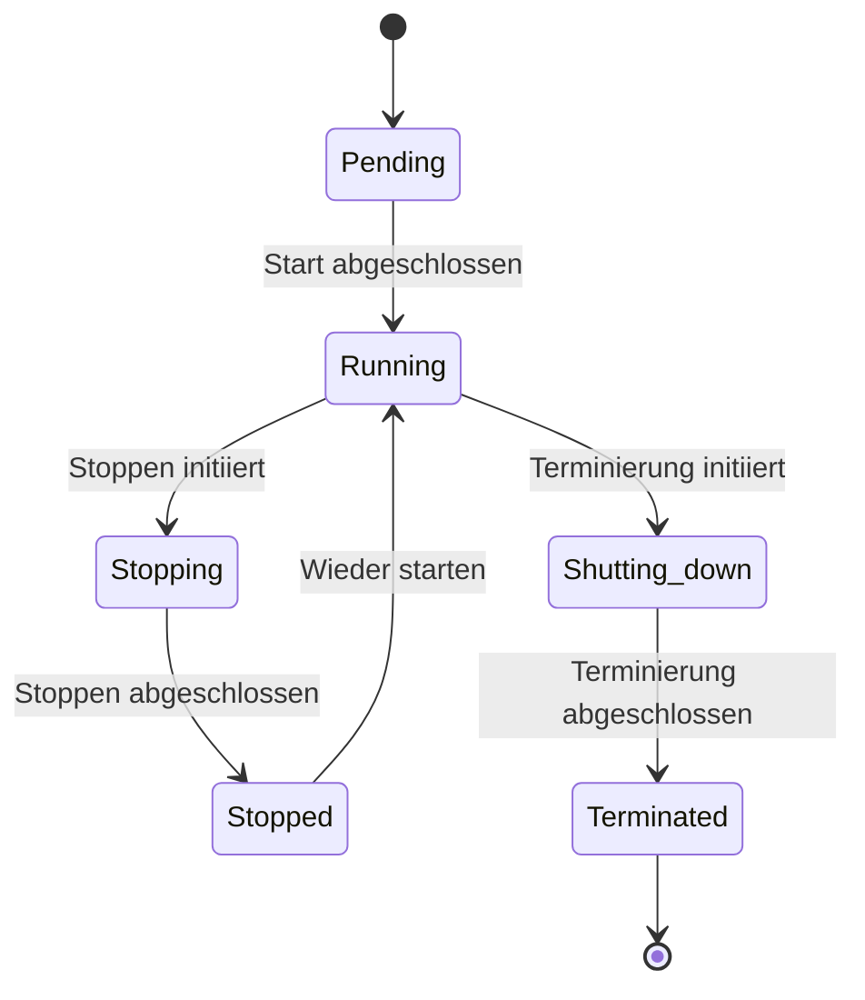

# Cloud Products

## EBS vs. S3

- EBS ist die «Festplatte» einer EC2 Instanz
- Ein EBS (Elastic Block Storage) wird ausschliesslich für eine EC2 Instanz verwendet und kann auch nur von einer einzigen eingesetzt werden, also nicht geteilt unter mehreren EC2
- EBS haben weniger Latenz bei Schreibzugriffen als S3
- S3 können auch «allein» ohne EC2 verwendet werden
- S3 können von mehreren EC2 Instanzen gleichzeitig eingesetzt werden

## COSMOS DB

TODO

## EC2

### Zustände

- Pending: Die Instanz wird initialisiert und ist **noch nicht betriebsbereit**.
- Running: Die Instanz ist aktiv und **kann verwendet werden**.
- Stopping: Die Instanz wird angehalten, aber **noch nicht komplett gestoppt**.
- Stopped: Die Instanz ist vollständig **angehalten und kann bei Bedarf wieder gestartet werden**.
- Shutting-down: Die Instanz **wird beendet und wird bald gelöscht**.
- Terminated: Die Instanz ist **dauerhaft gelöscht und kann nicht wiederhergestellt werden**.

**Zustandsdiagramm:**

## Elastic IP Addresses

Elastic IP-Adressen (EIP) sind statische, öffentliche IPv4-Adressen, 
die mit EC2-Instanzen in der AWS-Cloud verwendet werden können. 
Sie ermöglichen es, eine feste IP-Adresse zu haben, auch wenn die zugrundeliegende Instanz stoppt, 
beendet wird oder sich ihre dynamische IP-Adresse ändert. 
Hier ist eine kurze Erklärung der Funktionsweise:

1.	Eine Elastic IP wird einem AWS-Konto zugewiesen.
2.	Diese Elastic IP kann einer EC2-Instanz zugewiesen werden.
3.	Sollte die Instanz gestoppt oder beendet werden, kann die Elastic IP einer neuen Instanz zugewiesen werden.
4.	**Auf diese Weise können externe Nutzer immer dieselbe IP-Adresse verwenden, um eine Verbindung zu deiner Anwendung herzustellen, selbst wenn sich die zugrunde liegende Infrastruktur ändert.**

