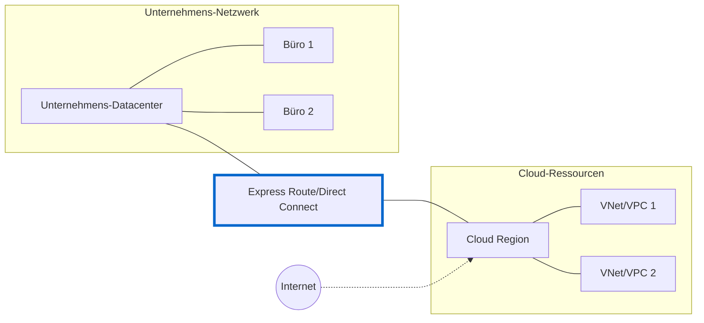

# Express Route / Direct Connect Erklärung

Eine Express Route (Azure) oder Direct Connect (AWS) ist eine private, dedizierte Netzwerkverbindung zwischen einem Unternehmens-Netzwerk und der Cloud, die nicht über das öffentliche Internet läuft.

## Hauptmerkmale

1. Verbindungstypen

- Private Peering: Zugriff auf VMs/Dienste in virtuellen Netzwerken
- Microsoft/AWS Peering: Zugriff auf öffentliche Dienste (z.B. Storage, Datenbanken)
- Layer 3 Konnektivität: BGP für Routing-Updates

2. Vorteile

- Höhere Bandbreite (bis zu 100 Gbps)
- Geringere Latenz (vorhersagbar)
- Bessere Zuverlässigkeit
- Erhöhte Sicherheit
- Kosteneinsparungen bei großen Datenmengen

3. Sicherheitsaspekte

- Kein Transit durchs öffentliche Internet
- Verschlüsselung möglich (Layer 2/3)
- Integrierte Firewall-Optionen
- Network Security Groups (NSG)
- Private IP-Adressierung

## Unterschiede zum VPN - Express Route / Direct Connect

- Permanent physische Verbindung
- Keine Client-Software erforderlich
- Höhere Bandbreite
- Vorhersagbare Latenz
- Layer 2/3 Verbindung
- BGP-basiertes Routing
- Hohe Implementierungskosten

## Verbindungsaufbau im Detail

1. Physische Verbindung

- Kein Client notwendig - anders als bei VPN
- Dedizierte physische Leitung vom Rechenzentrum zum Cloud-Provider
- Realisiert über:
  - Direct Cross-Connect im selben Rechenzentrum
  - Point-to-Point Ethernet
  - MPLS-Verbindung über Carrier

2. Netzwerk-Equipment

**Unternehmensseite**
- Enterprise Router (z.B. Cisco, Juniper)
- Muss BGP-fähig sein
- Unterstützung für erforderliche Bandbreite
- Layer 3 Routing-Funktionalität

**Provider-Seite**
- Provider Edge (PE) Router
- Meet-Me-Room für Cross-Connect
- Redundante Switches
  
**Cloud-Seite**
- Cloud Edge Router
- Virtual Network Gateway
- Software-defined Networking

3. Konfigurationsebenen

**Layer 1 (Physisch)**

- Dedizierte Glasfaser
- Redundante Paths
- Cross-Connect im Datacenter

**Layer 2 (Data Link)**

- VLAN Tagging
- MAC Address Learning
- Q-in-Q Tagging (optional)
- Link Aggregation (LAG)

**Layer 3 (Netzwerk)**

- BGP Routing
- AS Numbers
- IP Prefixes
- Route Filters
