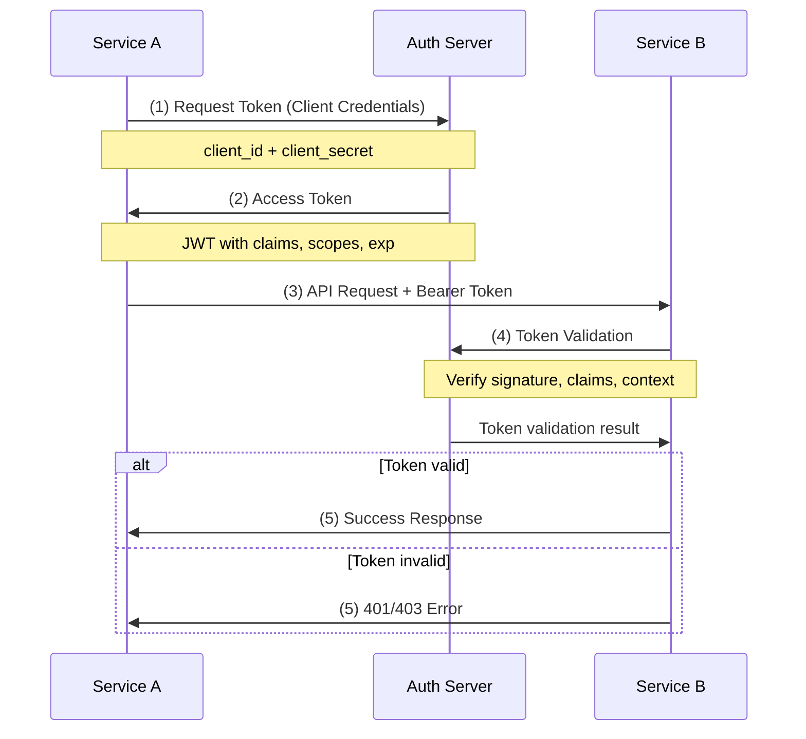

# Zero Trust Sicherheitsmodell

## Grundprinzip

- "Never trust, always verify" - Vertraue niemandem, überprüfe immer
- Jede Anfrage wird als potenziell feindlich betrachtet
- Zugriff wird basierend auf Identität und Kontext gewährt
- Kein implizites Vertrauen, **auch nicht im internen Netzwerk**

# Beispiel: Service-zu-Service Kommunikation

## Konzept

## Implementierungsschritte

**Service Registration**

- Jeder Service erhält eigene Client ID und Secret
- Definition erlaubter Scopes und Rollen
- Hinterlegung von Service-Metadaten

**Authentifizierung**

- Client Credentials Grant Flow
- JWT (JSON Web Tokens) für Tokenformat
- Kurze Token-Lebensdauer (z.B. 1 Stunde)
- Regelmäßige Secret-Rotation

**Autorisierung**

- RBAC (Role Based Access Control)
- Feingranulare Permissions pro Endpoint
- Validierung von Claims im Token
- Kontext-basierte Entscheidungen

## Sicherheitsmaßnahmen

**Network Level**

- TLS/mTLS für verschlüsselte Kommunikation
- Network Segmentation
- Service Mesh für Traffic-Kontrolle
- Rate Limiting

**Application Level**

- Token Binding
- Request Signing
- Audit Logging
- Intrusion Detection
