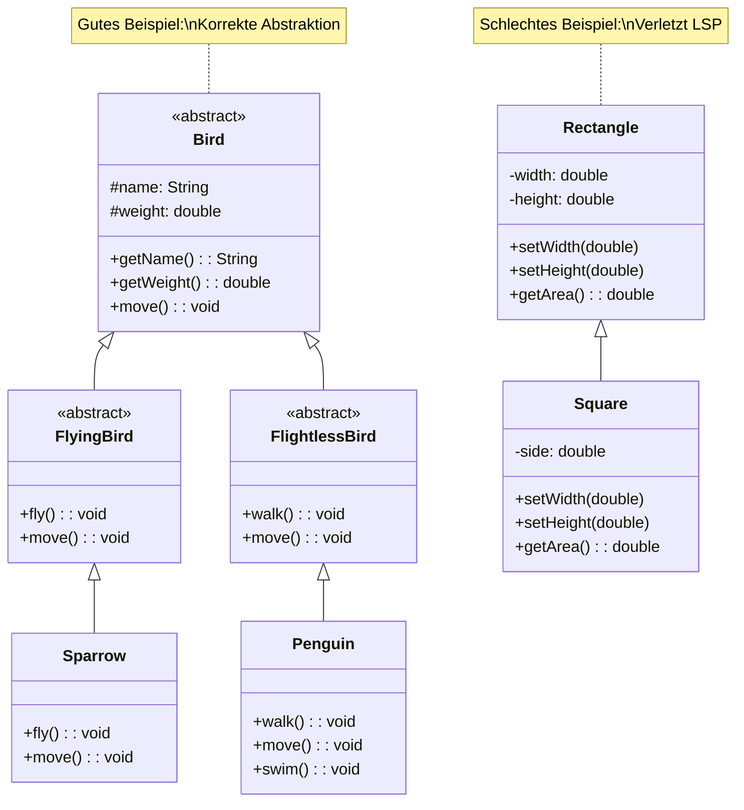

# Architektur Prinzipien

## SOLID

1. Single Responsibility
2. Open/Closed
3. Liskov Substitution
4. Interface Segregation
5. Dependency Inversion

### Single Responsibility 

Siehe [Single Responsibility](https://wiki.strubli.com/docs/swa/architecture-patterns/#single-responsibility-prinzip-srp)

### Open/Closed

> "Classes should be open for extension but closed for modification."

### Liskov Substitution

> "Objekte einer Superklasse sollen durch Objekte ihrer Subklassen ersetzt werden können, ohne dass die korrekte Funktionsweise des Programms beeinträchtigt wird."

**Hauptaspekte des LSP:**

1. Verhaltenskompatibilität
- Subklassen müssen alle Verträge (Contracts) der Basisklasse erfüllen
- Keine Abschwächung der Vorbedingungen
- Keine Verstärkung der Nachbedingungen
- Invarianten müssen erhalten bleiben

2. Signaturkompatibilität
- Parameter-Typen dürfen in Subklassen nur weiter werden
- Rückgabe-Typen dürfen in Subklassen nur enger werden
- Exceptions dürfen nur weniger oder spezieller werden

**Best Practices**

1. Abstraktionen richtig verwenden
2. Ersetzbarkeit prüfen
3. Tell, Don't ask

### Interface Segregation

> "Clients sollten nicht gezwungen werden, von Interfaces abzuhängen, die sie nicht verwenden."

TODO...

### Dependency Inversion

